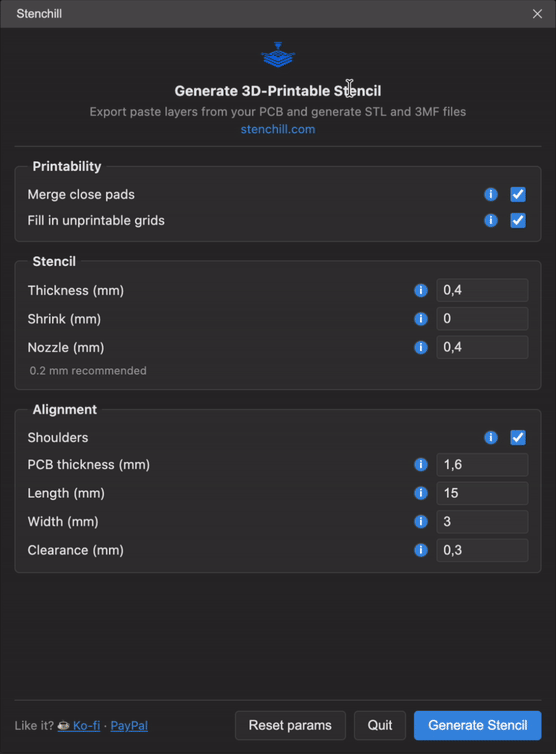
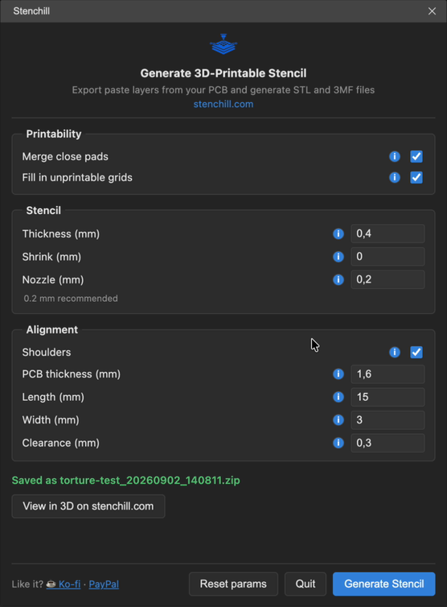
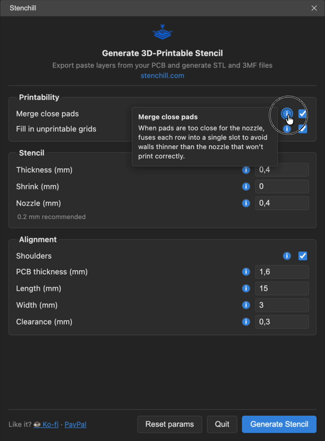

[简体中文](#) | [English](./README.en.md)

# Stenchill

把电路板的锡膏层变成钢网，用普通的 FDM 打印机就能打印，全程不必离开
EasyEDA Pro。无需手动导出 Gerber，无需自己打包 zip，也无需把文件拖进浏览器。

## 演示

*一次完整操作，未经剪辑：帮助气泡、设为 0.2 mm 的喷嘴、五个生成步骤，以及保存下来的压缩包。*

## 安装

从 [最新发布](https://github.com/Chewby/stenchill-easyeda-extension/releases/latest)
下载 `.eext` 文件，然后在 EasyEDA Pro 中：`高级` → `扩展管理器` → `导入`。

打开一块 PCB，菜单会出现在 `高级` → `Stenchill` 下。

## 使用方法

打开一块 PCB，然后选择 `高级 → Stenchill → 生成钢网...`。

选好参数，点一下即可。扩展会导出锡膏层和板框，发送到 stenchill.com，实时跟踪
生成过程，最后交给你一个包含 STL 和 3MF 文件的压缩包，以工程名和时间命名。
点击 "View in 3D" 会在网站上打开结果，并带上你刚才使用的参数。

默认值适用于大多数板子：厚度 0.4 mm、不收缩、喷嘴 0.4 mm、合并相邻焊盘、
填充无法打印的阵列，以及开启定位支架。如果你的打印机有 0.2 mm 的喷嘴，
效果会明显更好。

你的参数会在两次运行之间保留。

## 参数

每一行都带有一个 `i` 标记，点击可以看到该参数的简短说明。

| 参数 | 默认值 | 范围 | 作用 |
|---|---|---|---|
| 厚度 | 0.4 mm | 0.1 至 0.6 | 钢网板的厚度，决定锡膏的沉积量 |
| 收缩 | 0 mm | -0.2 至 0.3 | 把每个开孔缩小这么多。负值则是放大 |
| 喷嘴 | 0.4 mm | 0.1 至 0.8 | 你打印机的喷嘴直径，决定补偿量 |
| 合并相邻焊盘 | 开 | 开/关 | 把一排细间距焊盘合并成一个长孔，避免留下任何喷嘴都打印不出的薄壁 |
| 填充无法打印的阵列 | 开 | 开/关 | 当阵列的壁比喷嘴还薄时，填掉它的开孔 |
| 定位支架 | 开 | 开/关 | 加上固定电路板并对齐钢网的角部支撑 |
| PCB 厚度 | 1.6 mm | 0.4 至 3.2 | 你板子的厚度，决定支架的高度 |
| 支架长度 | 15 mm | 1 至 200 | 每个 L 形支架沿板边延伸的长度 |
| 支架宽度 | 3 mm | 0.5 至 8 | L 形支架的壁厚 |
| 支架间隙 | 0.3 mm | 0 至 1 | 电路板与支架内壁之间留出的间隙 |

## 运行条件

**EasyEDA Pro 桌面客户端。** 不支持网页版：浏览器会强制执行跨域限制，而桌面
客户端不会，因此在网页版中对 stenchill.com 的调用会被拦截。

需要联网。生成过程在 stenchill.com 上运行。

## 语言

界面跟随 EasyEDA Pro 自身的显示语言，支持英语和简体中文。没有对应译文的内容
会回退到英语。

## 会发送什么

只有当前打开的这块板子的锡膏层和板框，而且只在你点击生成时才发送。PCB 上的
其他内容都不会离开你的电脑。

**它还会询问 stenchill.com 是否有更新版本**，仅在你打开对话框时询问，其余时候
都不会。这次调用只携带扩展的版本号，别无其他，15 秒后放弃，并且失败时不会打扰
你。发现新版本时，对话框会立刻在标题下方用横幅告诉你。

## 关于你的 Gerber 文件

生成过程在 stenchill.com 上运行。在某些情况下我保留保存你的 Gerber 文件的权利，
主要用于排查问题，其中一部分会作为长期测试用例保留下来，在引擎每次改动时重新
跑一遍，以确保某个修复不会让原本正常的板子出问题。这些文件严格限于内部使用，
绝不对外分享。

完整政策：https://www.stenchill.com/privacy-policy

## 链接

- [stenchill.com](https://www.stenchill.com)
- [源码与问题反馈](https://github.com/Chewby/stenchill-easyeda-extension)
- [KiCad 插件](https://github.com/Chewby/stenchill-kicad-plugin)，为 KiCad 用户
  提供同样的功能。

采用 MIT 许可证。
